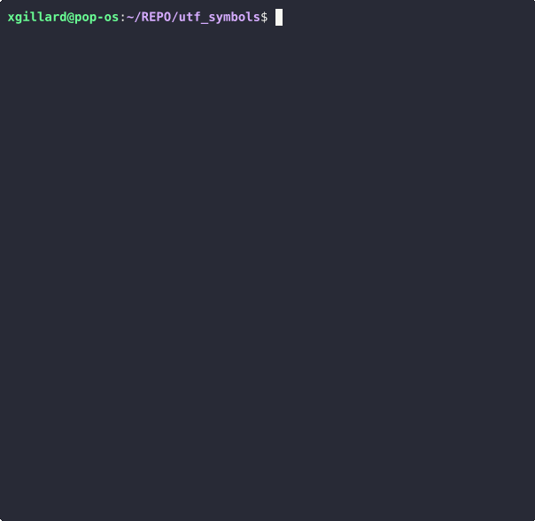

# UTF-SYMBOLS

As it happens, I often use ideograms in my talks as I find them to be a good way to visually
convey the intuition of what I mean. For that purpose, the UTF database is quite an incredible
source since it comprises tons of ideograms that can be used reliably and for free. This is
how this tool was born: a quick hack to search the few characters I wanted to find.



## Build

To build this project, you will need to have a rust toolchain installed on your machine. If it
is not already the case, you can follow the instructions given here: https://www.rust-lang.org/learn/get-started
Once this is out of the way, building the project is as simple as running the following command:

``` 
cargo build --release
``` 

## Installation on your system path

If you're like me and you like this tool so much that you want to be able to use it just anywhere
and anytime, you can install it on your machine with the following command


```
cargo install utf_symbols
```

Or, if you want to build it from sources:
``` 
cargo install --path .
```